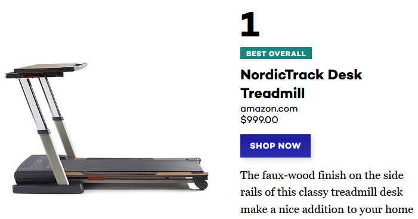

## Brainstorming ideas

Feb 14, 2020

### Disrupting seminars:
  * Work(out)shops in the gym
  * Conferences and/or workshops via Zoom
    * Brian Dillon at Cornell has organized a (small) conference like this   (everyone got mugs saying "I wasn't there")
	* Presentations in high schools: one in-person presentation + a few via zoom to save on travel time
  * For all of the above, the cost-benefit analysis project could be a student assignment or project:
    1. quantify the environmental benefits
	2. estimate the health impacts (selection is an issue of course)

### Other ideas:
* Rotating hot desks for academics
* Shared treadmill desk(s)
  * reasonably prices options exist or can hack one with treadmill and height-adjustable desk
  
  * a pedometer that you can clip on while using it
  * $\rightarrow$ an indicator/tracker on the website showing how many steps staff have taken
